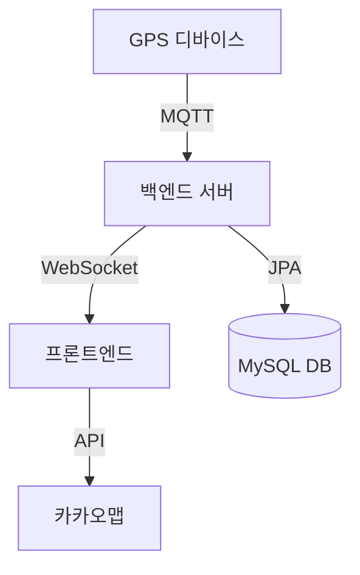

# 🚌 MOVE - 실시간 위치 조회 시스템

[](https://github.com/gwondev/move/blob/main/LICENSE)
[](https://github.com/gwondev/move/actions/workflows/deploy.yml)

<div align="center">
  
  <p><strong>GPS 기반 위치 수집, 실시간 데이터 처리, 지도 연동 기술을 활용한 경량형 이동체 실시간 위치 조회 시스템</strong></p>
</div>

> 2025 ICT이노베이션스퀘어 개발자 소그룹 팀빌딩 6기 팀 프로젝트

## 📍 프로젝트 소개
### 💡 기획 의도
**기약없는 대기** </br>
- 교내 셔틀버스나 순환 차량, 물류 장비 등의 위치를 실시간으로 알 수 없어 발생하는 불확실한 대기 시간은 일상 속 스트레스를 유발하기도 합니다. </br> 
- 이러한 스트레스를 해소하고, 사용자가 스스로 시간과 경로를 효율적으로 조절할 수 있도록 돕고자 기획되었습니다. 
</br>

### 🚩 프로젝트 목표
#### 콘텐츠 목표
- 실시간 위치 파악으로 사용자 편의성과 운영 효율 향상
#### 주요 활용시나리오
- 교내 셔틀버스, 캠퍼스 카트, 배송 로봇 등 경량형 이동체의 위치 추적에 적용
#### 디자인 방향
- 누구나 쉽게 위치를 확인할 수 있는 지도 기반의 직관적 UI
- 이동체 아이콘, 경로 히스토리, 상태 정보 등을 제공할 수 있는 디자인
#### 시스템 구성 및 규칙
- GPS 장치 → 백엔드 서버 → DB → 프론트(실시간 웹 연동)
</br>

### 👀 기대효과 및 이후 활용 방안
**디지털 전환의 실질적 도입 사례 확보**
- 이 프로젝트에서는 단순한 연습용이 아닌, 학교나 공공기관, 기업에서도 실제로 바로 활용 가능한 수준의 시스템 구축을 목표로 합니다.
- 추후 경로 예측 알고리즘, 알림 기능 등을 추가하여 지역 교통, 물류 관리, 자율주행 서비스와의 연계 확장의 가능성이 있습니다.

## 🎯 주요 기능

### 1. 실시간 위치 추적
- WebSocket을 통한 실시간 GPS 데이터 수신
- 부드러운 마커 이동 애니메이션
- 이동 방향 표시 기능

### 2. 사용자 인터페이스
- 직관적인 지도 기반 UI
- 운수회사별 필터링
- 반응형 디자인

### 3. 시스템 아키텍처


## 📦 시스템 구성도

```
[IoT 디바이스]
     ↓ MQTT
[백엔드 서버] ←→ [MySQL]
     ↓ WebSocket
[프론트엔드]
     ↓ REST
[카카오맵 API]
```

## 🚀 배포 프로세스

### CI/CD 파이프라인

1. **GitHub Actions 트리거**
   - main 브랜치 push 시 자동 배포 시작
   - GitHub Secrets를 통한 민감 정보 관리

2. **백엔드 빌드 프로세스**
   ```bash
   ./gradlew clean bootJar -x test
   ```

3. **프론트엔드 빌드 프로세스**
   - 환경 변수 주입
   - Vite 빌드 최적화

4. **Docker 컨테이너화**
   ```yaml
   services:
     frontend:
       build: ./frontend
       ports:
         - "5173:5173"
     backend:
       build: ./backend
     db:
       image: mysql:latest
   ```

5. **Caddy 리버스 프록시**
   - 자동 HTTPS 인증서 발급
   - 도메인 기반 라우팅

### 모니터링 및 로깅
- 서비스 상태 모니터링
- 에러 로깅 및 알림

## 🛠️ 사용 기술 스택

### Frontend


### Backend


### Infra & Deploy


</br>
</br>

## 👥 팀 구성원

| 역할 | 이름 | 소속 | 전공 | 담당 업무 |
|------|------|------|------|------------|
| 팀장 | 이성권 | 조선대학교 | 컴퓨터공학과 | 프로젝트 총괄, 시장조사 및 타당성 검토, 일정 관리, 문서화 |
| 팀원 | 강형욱 | 조선대학교 | 정보보안전공 | DB 설계 및 연결, 백엔드 구현 |
| 팀원 | 김민서 | 조선대학교 | 정보보안전공 | UI/UX 구현, 프론트엔드 개발, 사용자 경험 개선 |
| 팀원 | 조용준 | 조선대학교 | 컴퓨터공학과 | GPS 모듈 통신 및 시스템 연결, 전자회로 설계 및 부품 구성 |

## 🔧 설치 및 실행 방법

### 요구사항
- Docker & Docker Compose
- Node.js 18+
- JDK 17
- Arduino IDE (IoT 개발용)

### 로컬 개발 환경 설정

1. **저장소 클론**
   ```bash
   git clone https://github.com/gwondev/move.git
   cd move
   ```

2. **백엔드 실행**
   ```bash
   cd backend
   ./gradlew bootRun
   ```

3. **프론트엔드 실행**
   ```bash
   cd frontend
   npm install
   npm run dev
   ```

4. **환경 변수 설정**
   ```bash
   # frontend/.env 파일 생성
   VITE_WS_URL=http://localhost:8080/ws
   VITE_IO_URL=http://localhost:8080
   VITE_KAKAO_MAP_APP_KEY=your_kakao_map_key
   ```

### Docker로 실행

```bash
docker compose up -d
```

## 📝 라이센스

이 프로젝트는 MIT 라이센스로 배포됩니다.

## 🤝 기여하기

1. Fork the Project
2. Create your Feature Branch (`git checkout -b feature/AmazingFeature`)
3. Commit your Changes (`git commit -m 'Add some AmazingFeature'`)
4. Push to the Branch (`git push origin feature/AmazingFeature`)
5. Open a Pull Request

## 📬 문의하기

프로젝트에 대한 문의나 피드백은 GitHub Issues를 통해 해주시기 바랍니다.
```